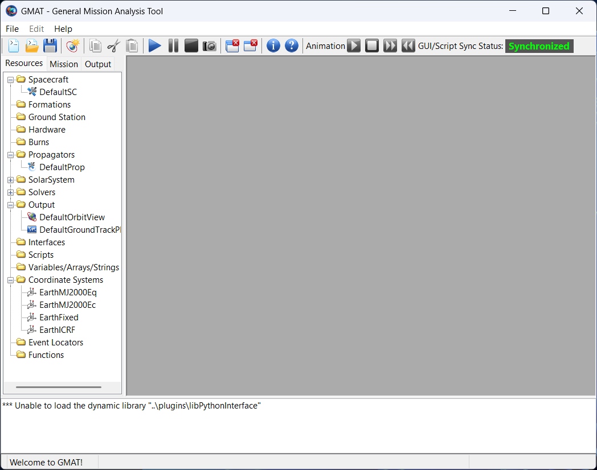
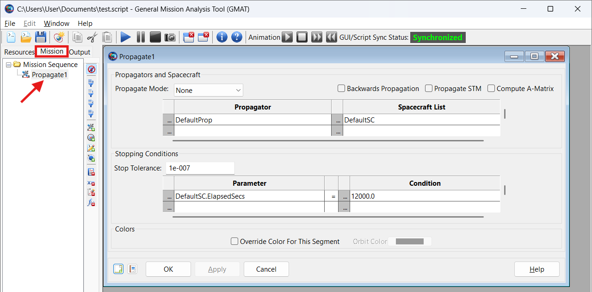

# GMAT and VTS Timeloop Software Manual

## Introduction

This manual aims to guide you through the basic functionalities of NASA's General Mission Analysis Tool (GMAT) and VTS Timeloop, which will be used during the laboratory. It is recommended to thoroughly familiarize yourself with the steps below before proceeding with the mission scenarios.

-----

## Part 1: General Mission Analysis Tool (GMAT)

### 1.1. Installation and First Launch

  * **Installation:** Follow the instructions available on the official GMAT website (https://software.nasa.gov/software/GSC-17177-1). Ensure you download the version appropriate for your operating system.
  * **First Launch:** After installation, launch GMAT. Familiarize yourself with the main application window.

### 1.2. Overview of the GMAT User Interface

The main components of the GMAT interface are:

  * **Resources/Mission/Output Tree:** On the left side, contains all mission elements (spacecraft, propagators, coordinate systems, plots, reports, etc.).
  * **Workspace:** On the right side, the gray area, will display all windows, plots and text editors as you open them from the Tree on the left.
  * **Message Window Panel:** At the bottom, displays logs, errors, and warnings.
  * **Toolbar:** At the top, contains buttons for running simulations, saving, opening, etc.

  

### 1.3. Basic Steps for Creating a Mission in GMAT

The following outlines a typical workflow for creating a new mission.

**Step 1: Creating a `Spacecraft` Object**

1.  In the Resources Tree, right-click on the `Spacecraft` folder and select `Add Spacecraft`.
2.  Name your spacecraft (e.g., `MySat`). Note: `DefaultSC` might already be created, double-click to edit it!
3.  In the opened spacecraft configuration window, you can define its parameters:
      * `Epoch format`: Date format used for the mission; Modified Julian Date, Gregorian (e.g., `UTCGregorian`).
      * `Epoch`: Initial date and time of the mission (e.g., `01 Jan 2025 12:00:00.000 UTCG`).
      * `CoordinateSystem`: The coordinate system in which you define the initial state (e.g., `EarthMJ2000Eq` - Earth Mean J2000 Equatorial).
      * `state Type`: Type of orbital elements for display and editing (e.g., `Keplerian`).
      * Enter values for the 6 Keplerian elements (SMA, ECC, INC, RAAN, AOP, TA/MA - [see scenarios](SCENARIOS.md)).
      * In the `Ballistic/Mass` tab you can also define mass (`DryMass`), ballistic coefficients (`DragCoefficient`, `DragArea`), solar radiation pressure coefficients, etc., if required by the force model.
4.  Click `Apply` and `OK`.

**Step 2: Defining Coordinate Systems (if different from default)**

  * GMAT uses standard systems by default (e.g., `EarthMJ2000Eq`, `EarthFixed`). Usually, there's no need to create new ones for basic LEO missions.

**Step 3: Configuring the Propagator (e.g., `Prop_Default`)**

1.  In the Resources Tree, find the `Propagators` folder, and within it, the default propagator (e.g., `DefaultProp`). Double-click it.
2.  In the propagator configuration window (optional to configure, defaults are ok for this excercise):
      * `ForceModel`: Select the force model. Click `Edit` next to `ForceModel`.
          * `PrimaryBody`: Usually `Earth`.
          * `GravityField`: Earth's gravity field model (e.g., `JGM-2` or `JGM-3` of a specific degree and order, e.g., `4x4`).
          * `Atmosphere`: Atmosphere model (e.g., `JacchiaRoberts` or `MSISE90`), if you want to include drag.
          * `SolarRadiationPressure`: If you want to include solar radiation pressure.
          * Add other forces as needed (e.g., Moon's gravity, Sun's gravity).
      * `Integrator`: Type of numerical integrator (e.g., `RungeKutta89`).
      * `InitialStepSize`: Initial time step for integration (e.g., `60` seconds).
3.  Click `Apply` and `OK`.

**Step 4: Defining Mission Commands (Mission Sequence)**


1.  Above the Resources Tree, find `Mission` tab and locate `Mission Sequence` tree. Double-click to open the editor.
2.  A basic mission sequence for simple propagation might look like this:

  

3. When you click the button in bottom-left corner (`Show Script`) or click `F7` on your keyboard, you will see the code equivalent of the Propagator. Something like this:
    ```gmat
    Propagate DefaultProp(MySat) {MySat.ElapsedSecs = 86400.0}; // Propagate for 86400 seconds (1 day)
    ```
    Or propagate until a certain number of orbits are completed:
    ```gmat
    Propagate DefaultProp(MySat) {MySat.Earth.PeriapsisCount = 3}; // Propagate for 3 periapsis passages
    ```

**Step 5: Generating Output Data**

  * **`ReportFile` (Text Report File):**

    1.  In the Resources Tree, right-click on `Output` and select `Add -> ReportFile`.
    2.  Give it a name (e.g., `OrbitDataReport`).
    3.  In the configuration window:
          * `Filename`: Name of the output file (e.g., `orbit_data.txt`).
          * `Parameters`: Add parameters you want to save (e.g., `MySat.UTCGEpoch`, `MySat.EarthMJ2000Eq.X`, `MySat.EarthMJ2000Eq.Y`, `MySat.EarthMJ2000Eq.Z`, `MySat.Earth.Altitude`, `MySat.Earth.Latitude`, `MySat.Earth.Longitude`).
    4. Click `OK` to close

  * **`OrbitView` (3D Orbit Visualization):**

    1.  In the Resources Tree, right-click on `Output` and select `Add -> OrbitView`. `DefaultOrbitView` might already be created, edit it.
    2.  Give it a name (e.g., `MyOrbitView`).
    3.  In the configuration:
          * Add `MySat` to the list of objects to display.
          * Configure other options (view coordinate system, orbit visibility, Earth visibility, etc.).
    4.  No command needs to be added to the script; plots are updated automatically.

  * **`GroundTrackPlot` (Ground Track Plot):**

    1.  Similar to `OrbitView`, add an `XYPlot` (or `GroundTrackPlot`).
    2.  Configure axes: X as `MySat.A1ModJulian`, Y as `MySat.Earth.OrbitPeriod`.

  * **Exporting Ephemeris Data (e.g., CCSDS OEM):**

      * GMAT can generate ephemeris files in the CCSDS OEM (Orbit Ephemeris Message) standard.
      * In the Resources Tree, right-click on `Output` and select `Add -> EphemerisFile`.
      * Configure the file type as `CCSDS-OEM`.
      * Specify the object (`Spacecraft`), coordinate system, epoch format, and output time step.

### 1.4. Running the Simulation and Analyzing Results

1.  **Save the mission:** Click the floppy disk icon or `File -> Save`.
2.  **Run the mission:** Click the green "Run" button (arrow).
3.  Observe messages in the `Message Window` panel.
4.  After the simulation finishes, open the generated report files and analyze the plots (`OrbitView`, `GroundTrackPlot`).


### 1.5. Tips and Common Problems

  * **Script errors:** Carefully check the syntax in the script editor. The message panel often indicates the line with the error.
  * **Unstable propagation:** If the simulation "diverges" or ends with an error, try reducing the integrator's time step (`InitialStepSize`) or simplifying the force model.
  * **Units:** Ensure you are using consistent units (GMAT defaults to km, seconds, degrees).
  * **GMAT Documentation:** Use the extensive GMAT documentation available online ([suspicious link removed]) and the built-in help.

