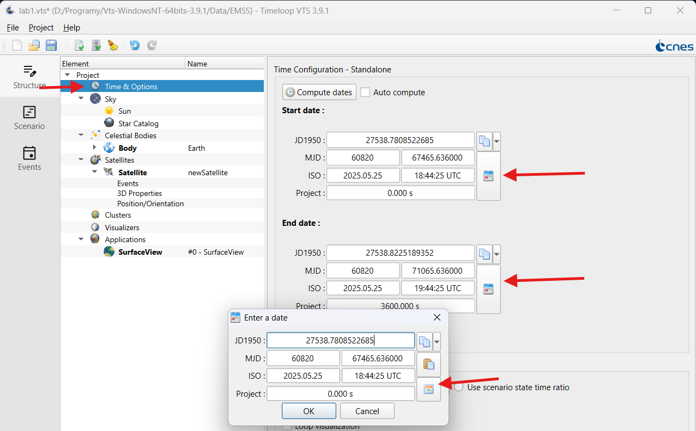
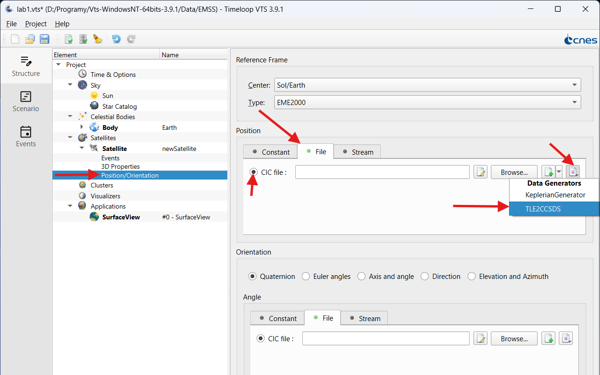
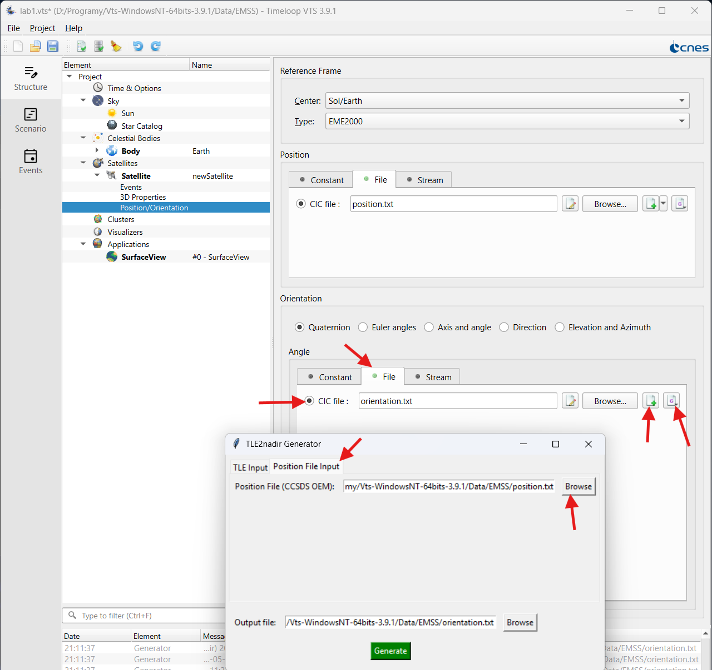
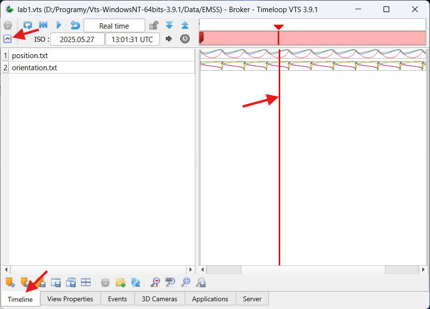
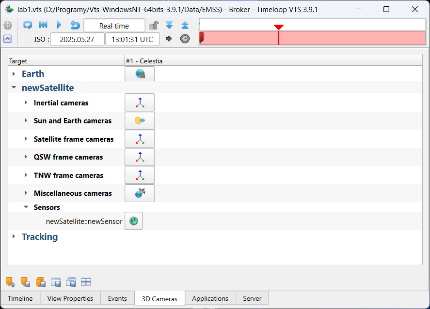
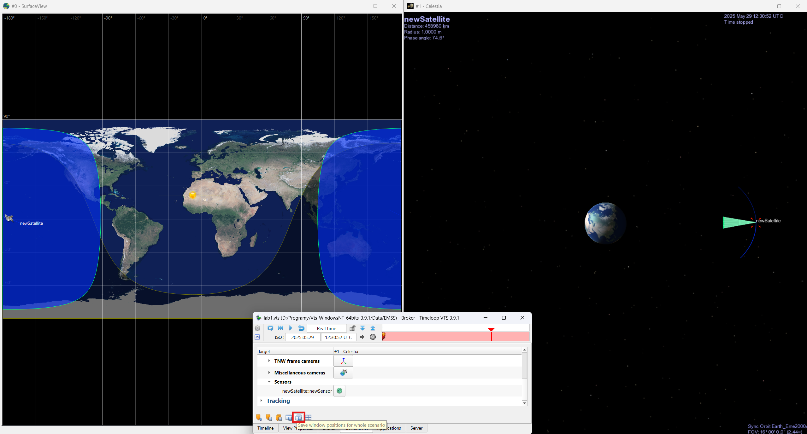

# GMAT and VTS Timeloop Software Manual

## Introduction

This manual aims to guide you through the basic functionalities of NASA's General Mission Analysis Tool (GMAT) and VTS Timeloop, which will be used during the laboratory. It is recommended to thoroughly familiarize yourself with the steps below before proceeding with the mission scenarios.

-----

## Part 2: VTS Timeloop

### 2.1. Installation and First Launch
  * **
  * **Installation:** Follow the instructions provided by the VTS Timeloop developers: https://timeloop.fr/vts/download/. You might need to input your email to download the software, but it is free!
  * **Dependencies:** You need [`Python`](https://www.python.org/downloads/) and [`Java 8`](https://www.java.com/en/download/) to be installed on your computer for all features to work correctly.
  * **First Launch:** Launch VTS Timeloop. Familiarize yourself with the interface.

### 2.2. Overview of the VTS Timeloop User Interface

The VTS Timeloop interface typically consists of:

  * **Structure Panel**: Includes a `Project tree` with all elements of the simulation; Time, Cellestial bodies, Satellites and Applications
  * **Scene/Object Panel:** A list of all objects in the scene (satellites, sensors, ground stations, cellestial bodies).
  * **Menu and Toolbar:** Access to import, save and validation of the project file.
  * **Play button** (Bottom-left corner): Starts the simulation and opens defined Applications.

*(Note: The exact appearance of the interface may vary depending on the VTS Timeloop version. The following steps are general.)*

### 2.3. Basic Steps for Creating a Visualization in VTS Timeloop

**Step 1: Creating a New Scene/Project**

  1.  Typically, a default scene is created upon program launch, or you can create a new one via the menu (`File -> New Project`).
  2. First, set the deired timeframe for the project:
      * Select `Time & Operations` and select apropriate `Start date` and `End date`.
      * Click the calendar icon to open the input window.
      * In the input window, you can input the date manually, or click the calendar icon to fill in todays date.
      * Select apropriate time frame; a day/a week between the dates.

**Step 2: Defining a Satellite**

  1.  Add a new satellite object in the Satellite (e.g., `Add Object -> Satellite` or similar).
  2.  Give it a name (`Satellite Name`), Central body to orbit (`Sol/Earth`).
  3.  You can customise the colors of the spacecraft as they will be visible on the ground track and other plots. You can come back to these settings later.

**Step 3: Defining satellite position**
  1. Select `Position/Orientation` in the `Project tree`
  2. Select `File` in the `Position` section.
  3. Now you can either select the file previously generated via GMAT, or generate a new Ephemersis file (plus button). To fill the created file with data, use the `KeplerianGenerator` (last button on the right).
  4. Use Keplerian Orbit parameters established in GMAT.

**Step 4: Defining satellite orienation**

In order for the satellite to point towards earth, so that we can simulate what its sensor will see, we need to generate a orientation file. Otherwise, the satellite will point towards initial direction in the inertial space (i.e., towards stars).

  1. Select `Position/Orientation` in the `Project tree`
  2. Select `File` in the `Orientation` section.
  3. Create a new Orientation file (plus button). 
  4. Use `TLE2nadir` Generator to generate a nadir-pointing vector from the position file:

  Note: You might need to wait a moment when launching the generator for the first time. It will download the required dependencies in the background.

**Step 5: Defining and Configuring Sensors**

  1.  Right click on the satellite to which you want to add a sensor. Select `Add Sensor`.
  2.  Go to the newly created Sensor; you can change its name.
  3.  Go to `Sensor properites`; Choose the sensor type (e.g., elliptical, rectangular).
  4.  Configure sensor parameters:
    * **Shape and size:** E.g., cone angle for a conical sensor (`Half-angle around X/Y`).
    * **Range:** Minimum and maximum operating range (if applicable).
    * **Graphical properties:** Color, transparency of the sensor beam.
    * **Position/Orientation:** How the sensor is pointed relative to the satellite's axes. Default is towards the Z axis. Select `Orientation` -> `Axis and angle` -> `Angle` (e.g., 20 degrees) for the satellite to point 20 degrees off-nadir.

Play around with the `Half-angle`s and Range to achive good visualisation of your satellite sensor.

**Step 6: Adding Applications**
  In order to visualise the satellite in 3D, lets add `Celestia`:

  1. Right click on `Applications` in the Project tree.
  2. `Add application -> Celestia`
  3. Default settings should be enough.

**Step 7: Navigating in the 3D View and Time Control**

Once everything is set-up, click `Play` in the bottom-left corner of the app. Check the console for any errors.

  * **Navigation:** Use the mouse (left button to rotate, right to pan, wheel to zoom) or keyboard shortcuts to move around the 3D scene.
  * **Time Control:** Use the time control panel to:
      * Set the initial date and time of the simulation.
      * Play (`Play`), pause (`Pause`) the simulation.
      * Change the playback speed (`Time Scale`).
      * Rewind and fast-forward time.
  * **Timeline:** You can see the generated position and orientation data in the timeline (make sure to click the arrow in bottom-left corner for it to be visible). You can also move the red time-line to scrub through the data.
  
  * **3D Cameras:** You can change pre-defined views in Celestia using the `3D Cameras` tab.
   

**Step 5: Visualizing Trajectory, Ground Track, Sensor Coverage**

  * Move the visualisation apps around the screen as you please. You can save their positions in the broker window. If you want the windows to open in the same spot on your screen every time you launch the simulation, you can save their positions using the buttons at the bottom (`Save window positions for the whole scenario`).

  

  * Observe the satellite's movement along the orbit.
  * Observe how the sensor beam moves across the Earth's surface or in space. Analyze coverage areas.

### 2.4. Exporting Views/Animations

  * **Screenshots:** Use operating system's standard function to take screenshots of interesting views.
  * **Animations:** VTS Timeloop supports animation export (e.g., to video format), refer to the relevant options in the menu (`Cog icon -> Record movie`).

### 2.5. Tips and Common Problems

  * **Coordinate Systems:** Ensure all data (orbits, orientation) are defined and interpreted in consistent coordinate systems.
  * **VTS Timeloop Documentation:** Use the official documentation, tutorials, or help provided by the program developers: https://timeloop.fr/static/doc/manual/index.html
  * **File Formats:** Check which file formats are supported by your VTS Timeloop version for importing orbital data and 3D models.
